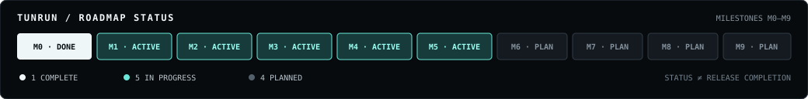

# TUNRUN
### A seed-driven procedural 3D tunnel runner

**Progress snapshot:** [Milestone status and acceptance gaps](docs/PROGRESS.md) · [Full roadmap](docs/ROADMAP.md)

TUNRUN is a native Windows 3D flight game project built around **unpredictably generated tunnels and obstacles**. The intended full game flies through curved, twisted, compressed, and expanding environments.

The repository has moved into native implementation. **M5 persistence and ship economy are in progress**: schema v3 stores career-best score/combo records, retains the accidental-corruption checksum, and tests v1/v2 upgrade paths; settings and progression save locally with backup recovery; the hangar uses Aether Shards and Singularity Cores to unlock and equip ships; and each ship has distinct speed, acceleration, boost-drain and energy-recovery parameters. Seeded tunnel generation, four deterministic aperture-gate families, moving procedural mines, and collectible Aether Shards/Singularity Cores now form the gameplay prototype. Gate validation includes both an all-ship pairwise kinematic screen and a fixed-step route probe that propagates a concrete position/velocity trajectory through consecutive gates using gameplay physics. The probe is a witness trajectory, not an exhaustive proof of every reachable state. Seed Lab displays course, gate, mine, and reward hashes with validation summaries and caches validation by seed/active ship rather than recomputing every frame; pickup contact is evaluated in the same course-relative frame as its rendered position. Gate and mine crash screens report the procedural obstacle index and deterministic distance for easier seed-based reproduction. The Windows CI build and unit tests are the source of truth; this is not a finished game.

## Core pillars

- **Real procedural generation:** seeded randomness, coherent noise, generated geometry, and compositional obstacle construction—not a fixed sequence of preset obstacles.
- **Seeded rewards:** Aether Shards render as cyan faceted gems and rarer Singularity Cores as larger warm-metallic 3D pickups; swept crossing checks award their run payout.
- **Obstacle readability:** standard, precision, offset and wide gates have different support structures without changing their collision apertures. Four seed-selected mine families now use distinct Orbital, Prism, Rotor and Cross silhouettes/palettes; the HUD names the next family. This is a cosmetic family layer over the existing mine physics, not four separate collision models.
- **Skill scoring and records:** clean gate passes earn accuracy bonuses, gate families have different base scores, and consecutive passes raise the in-run combo multiplier. Career-best score and combo persist in profile v3, the Records / Statistics screen displays them, and the crash/results screen distinguishes new personal records from failed saves.
- **Input and pause safety:** mouse flight can be enabled or disabled in Settings. During an active run, Windows Raw Input deltas steer toward a persistent in-tunnel aim point without cursor warping. A tunnel-aligned 3D reticle shows the target, which is clamped to the available opening as the tunnel narrows; the system cursor remains available for menus and pause. WASD and the gamepad left stick move laterally; arrow keys and the right stick control yaw/pitch, and Q/E roll the ship. Mouse sensitivity is adjustable and saved locally. Crash and Seed Lab seeds can be copied in exact round-trippable hexadecimal form. Destructive pause actions and settings reset ask for confirmation.
- **Refresh-aware frame pacing:** the renderer follows the monitor refresh rate up to 240 FPS, falls back to 144 FPS when the monitor query is invalid, and keeps flight physics on its separate fixed timestep.
- **Curving 3D tunnels:** changing centerlines, cross-sections, twists, widths, entrances, and transitions.
- **Fair unpredictability:** geometry bounds, gate clearance and reaction spacing are validated. A ship-specific pairwise kinematic reachability screen is now included; a full propagated-state proof and warning-time validation remain unfinished.
- **FPP and TPP:** switch between first-person and third-person cameras without resetting the run. TPP keeps the camera inside the tunnel, and the hangar uses a live 3D turntable preview. All eight ships have distinct wireframe silhouettes and different handling parameters.
- **Three input families:** keyboard, mouse, and gamepad operate gameplay and UI navigation; Seed Entry includes keyboard/paste and a gamepad character picker.
- **AI pilots and drones:** bots navigate the same generated world and obey the same collision rules.
- **Persistent progression (in progress):** settings, active ship, seed sequence, run/crash records, best distance, Aether Shards, and Singularity Cores persist locally. Ship purchase/unlock transactions are implemented; campaign progression remains unfinished.
- **Offline-first save:** versioned local save with atomic writes, backup, recovery, and a hidden Windows file/folder attribute.
- **Ship progression:** unlock prices are ten times the previous values; handling parameters are unchanged. Harder procedural courses have stronger bends/twist, tighter minimum tunnel sections, more precision/offset gates, and four mine silhouettes.
- **Native Windows release:** C++20, CMake and raylib are the selected prototype stack; the full game, save system, installer and updater remain unfinished.

## Game outline

- **Project/repository name:** TUNRUN
- **Genre:** procedural 3D tunnel runner / arcade flight
- **Primary platform:** Windows x64
- **Stack:** C++20, CMake, raylib 5.5 (pinned to an immutable upstream commit)
- **Save location:** `%LOCALAPPDATA%\\Tamasrazim\\TUNRUN\\`
- **Modes planned:** campaign, endless, seed challenge, daily challenge, practice, rival run, and ghost race

## Documentation map

### Design
- [Game Design](docs/GAME-DESIGN.md)
- [Flight and Camera](docs/FLIGHT-AND-CAMERA.md)
- [UI Specification](docs/UI-SPECIFICATION.md)
- [Ships and Economy](docs/ECONOMY-AND-SHIPS.md)
- [Art and Audio](docs/ART-AND-AUDIO.md)

### Engineering
- [Procedural Generation](docs/PROCEDURAL-GENERATION.md)
- [Procedural Rewards](docs/PROCEDURAL-REWARDS.md)
- [Procedural Moving Hazards](docs/PROCEDURAL-HAZARDS.md)
- [Technical Architecture](docs/TECHNICAL-ARCHITECTURE.md)
- [Bot AI](docs/BOT-AI.md)
- [Input and Save](docs/INPUT-AND-SAVE.md)
- [Save Schema](docs/SAVE-SCHEMA.md)
- [Build and Release](docs/BUILD-AND-RELEASE.md)
- [Security and Privacy](docs/SECURITY-AND-PRIVACY.md)
- [Third-Party and Licenses](docs/THIRD-PARTY-AND-LICENSES.md)
- [Third-Party Notices](THIRD-PARTY-NOTICES.md)

### Project management and quality
- [Decision Log](docs/DECISIONS.md)
- [Roadmap](docs/ROADMAP.md)
- [QA and Acceptance](docs/QA-AND-ACCEPTANCE.md)

## Main-only repository policy

All changes are committed directly to `main`. The project does **not** use other branches or pull requests. Pushes to `main` run repository integrity, secret scanning, and the Windows build/test workflow. Direct-to-main does not mean skipping checks.

## Current status

**TUNRUN is still a native gameplay prototype, not a finished release.** Profile v3 stores settings, active ship, seed progression, wallets, best distance, career-best score and best combo. Atomic writes, an accidental-corruption checksum, v1/v2 migration, backup recovery, and explicit non-destructive recovery are implemented and covered by automated tests. Campaign checkpoints, a separate Endless mode, additional physical hazard families/generation streaming, AI, imported production assets, installer and updater remain unfinished; four distinct procedural mine silhouettes and a longer section of the course are now shown at once. Windows CI now stages a portable development ZIP with license notices and a SHA-256 manifest; it is not the final installer. Current source-generated geometry does not justify padding the package—production assets must be real and licensed. Check [GitHub Actions](https://github.com/Tamasrazim/TUNRUN/actions) for build/test status. No finished game is claimed.

### Windows package size
This is still a code-driven prototype and has no production model, texture, or audio packs. A future 300–400 MB Windows package should earn its size through licensed models, materials, animations, music/SFX, and bundled runtime assets—not empty padding, duplicate files, or filler. No package at that size is claimed yet.
